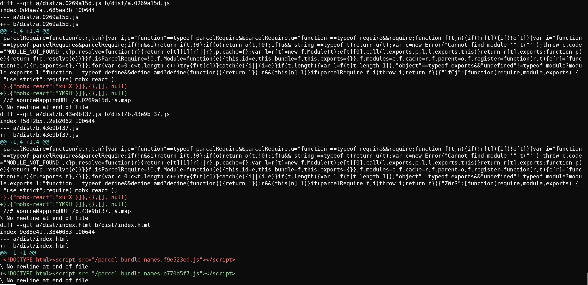

# Parcel Example Unchanged Filename

This example shows that the content of module a and b will change but not it's filename.

```bash
npm install
npx parcel build index.html --no-cache
# dist/parcel-bundle-names.f9e523ed.js        207.26 KB    8.91s
# dist/a.0269a15d.js                            1.15 KB     76ms
# dist/b.43e9bf37.js                            1.15 KB     62ms
npm install --save mobx-react@6
npx parcel build index.html --no-cache
# dist/parcel-bundle-names.e770a5f7.js        200.84 KB    18.23s
# dist/a.0269a15d.js                            1.15 KB      95ms
# dist/b.43e9bf37.js                            1.15 KB     103m
git diff dist
```

Compare the file `dist/a.0269a15d.js` before and after, and observe:

* mobx-react@5 reference: xuHX
* mobx-react@6 reference: YM9H


